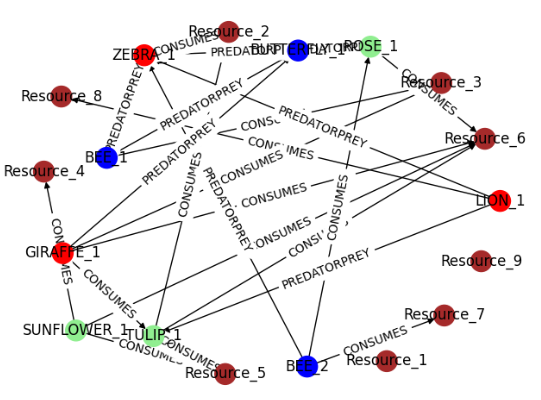

# ecosystem_graphs

This is a small work-in-progress repository for my exploration of graph data objects and graph neural networks for training and inference on these objects, implemented using networkx and PyTorch.
We do this through the concept of interacting organisms and resources in an interconnected ecosystem.
In src.life_graph_generation.py, we can generate a graph, currently through ugly hard-coded configurables, which describes a (currently static) ecosystem, and visualise this graph.

In graph_networks.py, we can define graph neural networks in PyTorch which can be trained on a simulated ecosystem graph, and be used to infer the position of new nodes (animals/insects/plants/resources) on this graph.

